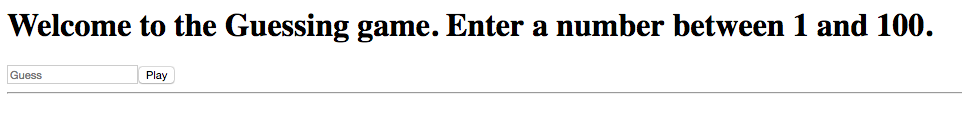

= Lab 01

[abstract]
In this lab you'll implement a guessing game using React. The objective is to get used to state.

== Application
Have a look at the screenshot below. +

* Create Lab01.html
* Implement a guessing game. 
* Your application will generate a random number between 1 and 100.
* User will play the game till he guesses the number correct.

* Given below are some screenshots
* 
* image:02.png[]
* image:03.png[]
* image:04.png[]
* image:05.png[]
* image:06.png[]
* image:07.png[]
* Don't worry too much about the look and feel of the page
* Don't give up.